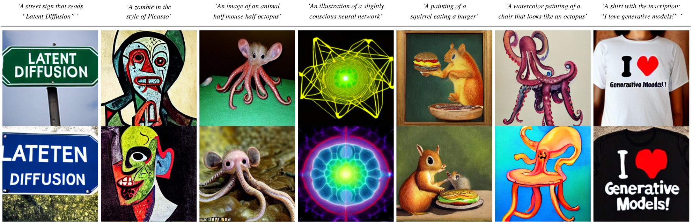

# Safe-SD: Safe and Harmless Stable Diffusion with Image Watermarks Injection
[CODE](https://github.com/AnonymousPony/safe-sd)

## Safe-SD Architecture
- Safe-SD mainly contains two stages: 1) Pre-train graphic watermark injector/extractor and 2) Fine-tune latent λ-encryption diffuser with prompt triggering.
- Moreover, we introduce a novel prompt triggering mechanism to enable adaptive watermark injection for facilitating copyright protection and generative traceability.

<p align="center">

</p>

## Experiments

### Pixel-wise Difference
- To verify the image generation quality with watermarking, and to qualitatively assess the fidelity of the decoded watermarks, we conduct the qualitative experiments. 
<p align="center">

</p>

### Watermarking Encryption
- We perform a study on the impact of watermarking frequency λ on image synthesis.
<p align="center">

</p>


### Watermarking vs Image Synthesis
- To further explore the impact of the weighting hyper-parameter γ on the training of dual-objective decoders, for trading off image synthesis and watermark extraction in a unified first-stage-model, we perform this study on hyper-parameter.
<p align="center">

</p>


- More pre-trained LDMs are available: 
  - A 1.45B [model](#text-to-image) trained on the LAION-400M database.
  - A class-conditional model on ImageNet, achieving a FID of 3.6 when using [classifier-free guidance](https://openreview.net/pdf?id=qw8AKxfYbI) Available via a [colab notebook](https://colab.research.google.com/github/CompVis/latent-diffusion/blob/main/scripts/latent_imagenet_diffusion.ipynb) [![][colab]][colab-cin].
  
## Requirements
A suitable [conda](https://conda.io/) environment named `safe-sd` can be created
and activated with:

```
conda env create -f environment.yaml
conda activate safe-sd
```

## Text-to-Image
 


Download the pre-trained weights (5.7GB)
```
mkdir -p models/ldm/text2img-large/
wget -O models/ldm/text2img-large/model.ckpt https://ommer-lab.com/files/latent-diffusion/nitro/txt2img-f8-large/model.ckpt
```
and sample with
```
python scripts/txt2img.py --prompt "a virus monster is playing guitar, oil on canvas" --ddim_eta 0.0 --n_samples 4 --n_iter 4 --scale 5.0  --ddim_steps 50
```
This will save each sample individually as well as a grid of size `n_iter` x `n_samples` at the specified output location (default: `outputs/txt2img-samples`).
Quality, sampling speed and diversity are best controlled via the `scale`, `ddim_steps` and `ddim_eta` arguments.
As a rule of thumb, higher values of `scale` produce better samples at the cost of a reduced output diversity.   
Furthermore, increasing `ddim_steps` generally also gives higher quality samples, but returns are diminishing for values > 250.
Fast sampling (i.e. low values of `ddim_steps`) while retaining good quality can be achieved by using `--ddim_eta 0.0`.  
Faster sampling (i.e. even lower values of `ddim_steps`) while retaining good quality can be achieved by using `--ddim_eta 0.0` and `--plms` (see [Pseudo Numerical Methods for Diffusion Models on Manifolds](https://arxiv.org/abs/2202.09778)).

#### Beyond 256²

For certain inputs, simply running the model in a convolutional fashion on larger features than it was trained on
can sometimes result in interesting results. To try it out, tune the `H` and `W` arguments (which will be integer-divided
by 8 in order to calculate the corresponding latent size), e.g. run

```
python scripts/txt2img.py --prompt "a sunset behind a mountain range, vector image" --ddim_eta 1.0 --n_samples 1 --n_iter 1 --H 384 --W 1024 --scale 5.0  
```
to create a sample of size 384x1024. Note, however, that controllability is reduced compared to the 256x256 setting. 

The example below was generated using the above command. 


## Unconditional Models

We also provide a script for sampling from unconditional LDMs (e.g. LSUN, FFHQ, ...). Start it via

```shell script
CUDA_VISIBLE_DEVICES=<GPU_ID> python scripts/sample_diffusion.py -r models/ldm/<model_spec>/model.ckpt -l <logdir> -n <\#samples> --batch_size <batch_size> -c <\#ddim steps> -e <\#eta> 
```


### LSUN Dataset

The LSUN datasets can be conveniently downloaded via the script available [here](https://github.com/fyu/lsun).
We performed a custom split into training and validation images, and provide the corresponding filenames
at [https://ommer-lab.com/files/lsun.zip](https://ommer-lab.com/files/lsun.zip). 
After downloading, extract them to `./data/lsun`. The beds/cats/churches subsets should
also be placed/symlinked at `./data/lsun/bedrooms`/`./data/lsun/cats`/`./data/lsun/churches`, respectively.


## Model Training

Logs and checkpoints for trained models are saved to `logs/<START_DATE_AND_TIME>_<config_spec>`.

### Training Autoencoder Models

Configs for training a KL-regularized autoencoder on ImageNet are provided at `configs/autoencoder`.
Training can be started by running
```
CUDA_VISIBLE_DEVICES=<GPU_ID> python main.py --base configs/autoencoder/<config_spec>.yaml -t --gpus 0,    
```
where `config_spec` is one of {`autoencoder_kl_8x8x64`(f=32, d=64), `autoencoder_kl_16x16x16`(f=16, d=16), 
`autoencoder_kl_32x32x4`(f=8, d=4), `autoencoder_kl_64x64x3`(f=4, d=3)}.

For training VQ-regularized models, see the [taming-transformers](https://github.com/CompVis/taming-transformers) 
repository.

### Training Latent Diffuser

In ``configs/latent-diffusion/`` we provide configs for training LDMs on the LSUN-, CelebA-HQ, FFHQ and ImageNet datasets. 
Training can be started by running

```shell script
CUDA_VISIBLE_DEVICES=<GPU_ID> python main.py --base configs/latent-diffusion/<config_spec>.yaml -t --gpus 0,
``` 

where ``<config_spec>`` is one of {`celebahq-ldm-vq-4`(f=4, VQ-reg. autoencoder, spatial size 64x64x3),`ffhq-ldm-vq-4`(f=4, VQ-reg. autoencoder, spatial size 64x64x3),
`lsun_churches-ldm-vq-4`(f=8, KL-reg. autoencoder, spatial size 32x32x4),`cin-ldm-vq-8`(f=8, VQ-reg. autoencoder, spatial size 32x32x4)}.


## Acknowledgement

- Our codebase for the diffusion models builds heavily on [OpenAI's ADM codebase](https://github.com/openai/guided-diffusion)
and [https://github.com/lucidrains/denoising-diffusion-pytorch](https://github.com/lucidrains/denoising-diffusion-pytorch). 
Thanks for open-sourcing!

- The implementation of the transformer encoder is from [x-transformers](https://github.com/lucidrains/x-transformers) by [lucidrains](https://github.com/lucidrains?tab=repositories). 


